# Full narrative report

# Study Objectives & Research Questions
This study was conducted by the Innovation & Impact Hub, part of the Turing Research and Innovation cluster for digital twins. The aim was to explore the challenges and opportunities for assurance of digital twins within the community, with a particular focus on the application of high-level guiding principles such as the Gemini Principles.

**The study was divided into three main topics and for each topic we defined a set of research questions**

- **topic 1:** Current understanding and practices in assuring digital twins.
	- **RQ1**: What is the maturity of the surveyed digital twin community?
	- **RQ2:** What is the community's current understanding of assurance?
	- **RQ3:** What practices are being used, including methods and properties assured?

- **topic 3:** Attitudes & perceived challenges in putting ethical and trustworthy digital twin principles into practice.
	- **RQ4**: How satisfied is the community with their assurance practices?
	- **RQ5:** How does the community perceive guiding principles (eg Gemini Principles)?
	- **RQ6:** What challenges do people encounter when putting the Gemini Principles into practice?

- **topic 4:** Readiness for, and attitudes towards, new tools for argument-based assurance.
	- **RQ7:** What is the community's readiness for argument-based assurance methods?
	- **RQ8**: What support is needed for successful adoption?

# Methodology

**Survey Sample and Recruitment**  
The survey aimed to gather insights from digital twin practitioners and was distributed to a number of digital twinning communities, including the main collaborator Connected Places Catapult Digital Twin Hub community (comprising industry, academia, and public sector), the DTnet+ community (an academic network of digital twin practitioners), and the broader Alan Turing Institute's university network. Participants were recruited through community newsletters and social media (Twitter & LinkedIn). The survey was conducted completely anonymous and we did not collect any sensitive data per default. Respondents could choose to submit their email address for the specific purpose of being contacted for events related to this piece of work.

We received a total of 50 responses, representing a broad spectrum of roles, including senior & strategic leadership, technical specialists, and research positions. The responses were roughly evenly split between these categories. Most participants reported balancing a range of responsibilities, including technical decision-making and operational management, while only four individuals included "Compliance" in their primary responsibilities.

**Demographics**  
Respondents came from ten different countries, with the majority based in the UK, and some selecting "global" as the primary location for their company. Survey participants represented over 19 different sectors, with larger groups emerging from Energy, IT, and Engineering sectors.

| Location              | Count |
|-----------------------|-------|
| United Kingdom        | 33    |
| Global                | 8     |
| United States         | 2     |
| France                | 1     |
| Germany               | 1     |
| Italy                 | 1     |
| Japan                 | 1     |
| Singapore             | 1     |
| South Africa          | 1     |
| United Arab Emirates  | 1     |

| Sector                             | Count |
|------------------------------------|-------|
| Energy                   
| Information technology / Software  | 5     |
| Engineering                        | 5     |
| Healthcare                         | 3     |
| Smart Cities                       | 3     |
| Other                              | 3     |
| Manufacturing                      | 3     |
| Artificial Intelligence            | 3     |
| Education                          | 3     |
| Defence                            | 3     |
| Construction                       | 2     |
| Technology                         | 2     |
| Transport                          | 2     |
| Environment and Conservation       | 1     |
| Aviation                           | 1     |
| National Government                | 1     |
| Place Leadership                   | 1     |
| Telecommunications                 | 1     |
| Water                              | 1     |

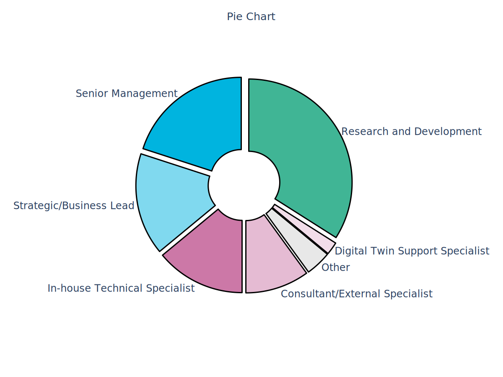

**Survey Structure and Content**  
The survey was divided into four sections: 
1) respondent company/organization demographics and experience level
2) current assurance practices
3) the Gemini Principles
4) new tools. 

The entire survey consisted of 25 core questions, with an additional eight questions that were conditional on previous responses. In addition, participants were asked to rate each Gemini Principle on how relevant and how challenging it was. The level of challenge, however, was only requested for those principles that were not deemed irrelevant. As a result, the number of questions varied considerably depending on the responses given throughout.

**Survey Format and Duration**  
The survey was developed as a web-based application using the open-source Python framework Streamlit, enabling an interactive and user-friendly experience for participants. It was hosted on Azure infrastructure to ensure scalability, reliability, and secure data handling. The codebase for the survey application is openly available on GitHub, promoting transparency and allowing others to replicate or build upon our approach. The survey took an average of 18 minutes to complete. Throughout the survey, respondents received live feedback on some of the aggregated answers that had been submitted so far, making the experience more engaging.

**Survey Period**  
The survey began in on May 30th and was open until July 31st.

**Data Analysis**  
For data analysis, we primarily used descriptive statistics to summarize quantitative responses. Additionally, we performed a more detailed content analysis on the qualitative data collected from four open-ended questions, with coding conducted by three independent coders to ensure reliability and depth of insights.

**Limitations**

One limitation of this survey is the bias towards participants from the UK. This bias is largely due to the networks through which the survey was distributed, which have a predominantly UK-based focus. Additionally, as the survey was conducted anonymously, we were unable to ensure balanced representation across other demographics. This anonymity, while protecting respondent privacy, limits our ability to assess and correct for potential imbalances in the survey sample.

# Findings

## Assurance Maturity / Current Practices

**1. High Adoption of Digital Twins Among Respondents**  
86% of respondents reported that they have established a digital twin, either directly or by supporting clients or providing components for digital twins. This high level of adoption indicates a mature and growing involvement with digital twin technology across the surveyed community.

**2. In-House Assurance Practices Prevail**  
The majority of respondents (68%) conduct assurance internally, with most relying on non-specialized teams for this process. Only 6% of respondents use external services, such as third-party assurance providers, while 18% of respondents themselves are the provider of assurance services. This suggests a strong preference for in-house assurance, though often with limited specialization.

**3. Assurance Focuses on Technical and Economic Performance**  
Most respondents assure approximately seven or fewer properties of digital twins, focusing primarily on technical and economic performance. Societal properties, such as safety and trustworthiness, are assured to a lesser extent, with ethical, legal, and regulatory aspects being even less frequently addressed. Ecosystem integration properties, except for interoperability, were the least selected, highlighting gaps in broader assurance considerations.

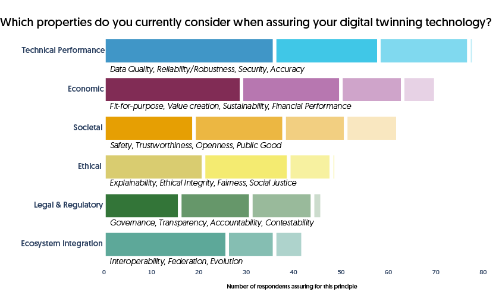

**4. Varied Understanding of Assurance in Digital Twins**

The understanding of assurance varied widely among respondents. Some focused on specific properties of digital twins, while others emphasized the broader goal of increasing trust. we observed key themes around **trust and confidence** as the primary outcome as well as mention of **validation, verification, or testing**, For example:

- "We ensure a digital twin is having the impact anticipated and operating effectively."
- "DT has been designed in accordance with requirements and is fulfilling them."
- "Continuous validation and verification against real-world conditions."
- "Verification and validation that the data is as intended."
- "Independent validation of transparency, security, and trustworthiness in the data, processes, and purpose of the digital twin."

Some responses mentioned specific goals such as accuracy, utility, privacy, and reliability. Notably, safety and compliance were less prominent.The diversity in responses indicates that assurance is not yet a mature or consistently shared concept across the digital twin community.

**5. Mixed Satisfaction with Assurance Practices and Communication**  
To understand satisfaction with current assurance practices, respondents were asked how satisfied they were with how their team identifies and documents requirements, actions, and decisions in their assurance process. We also provided three statements related to assurance integration, communication, and alignment with higher-level principles, and asked respondents to rate their level of agreement on a Likert scale from 1 (strongly disagree) to 5 (strongly agree).

Overall, respondents reported a high level of satisfaction with their assurance activities, particularly in the effectiveness of communicating assurance to build stakeholder trust. The majority agreed that assurance activities are substantively integrated into operational practices and that these activities can be clearly linked to higher-level trustworthiness and ethical principles. However, there was also a notable minority who disagreed with these statements, indicating variability in how assurance practices are perceived and implemented. This divergence may partly explain why 24% of respondents reported being unsatisfied with their overall assurance process.

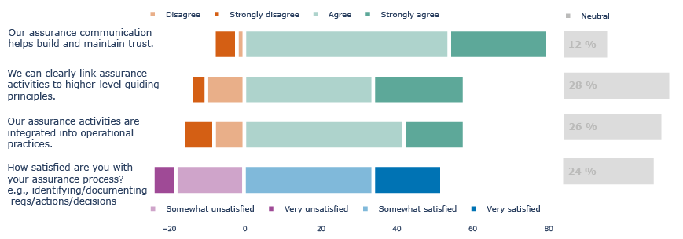

## Gemini Principles

**6. High Relevance but Limited Practical Value of Guiding Principles**  
To understand perceptions of guiding principles like the Gemini Principles, respondents were asked about their familiarity, use, and the relevance of these principles. 64% of respondents reported being somewhat familiar, with 30% actively using them as guidelines. The remaining respondents either had limited knowledge or were introduced to the principles for the first time through the survey.

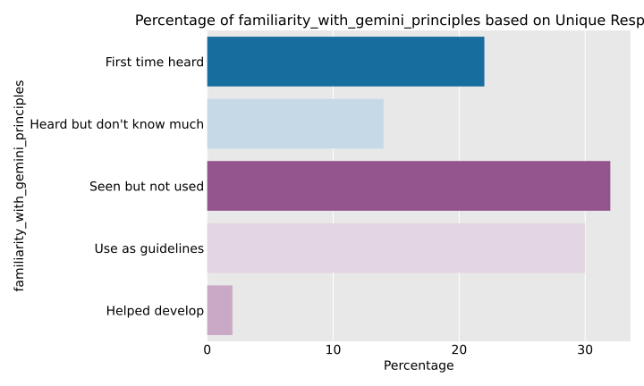

When asked to rate the relevance of each principle, most respondents indicated that they found them "very" or "extremely relevant," showing strong overall agreement on their importance. However, when assessing their practical value, responses were more mixed, with many considering the principles only "moderately valuable." This paradox suggests that while the principles are recognized as the right set of guidelines, they are not perceived as valuable in practice—likely because they are challenging to effectively implement.

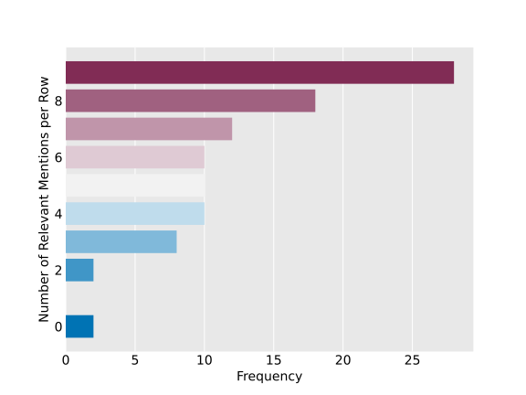

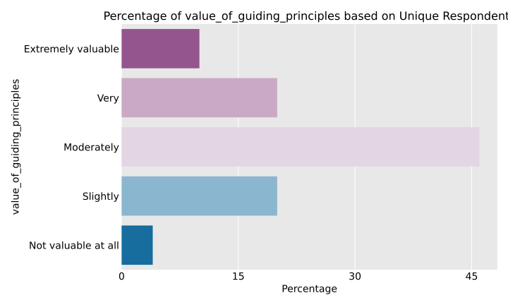

**7. High Relevance Ratings Across All Principles**  
All guiding principles were rated as either "Very" or "Extremely Relevant" by the majority of respondents, indicating a broad consensus on their overall importance. Among these, "Insight," "Value," and "Quality" were more often rated as "extremely relevant" compared to other principles, reflecting their particular significance within the community.

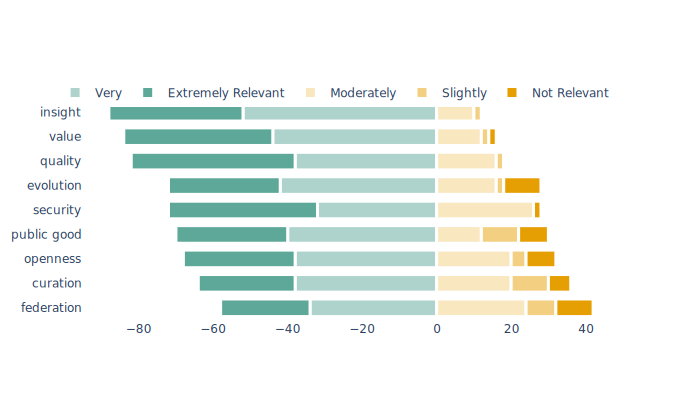

**8. Mixed perceived Challenges across Principles**

For all principles (except those rated as irrelevant), respondents were asked to rate how challenging each principle was to implement. While "Moderately Challenging" was the most common response across all principles (not displayed below!), notable differences emerged in the more extreme ratings. "Federation" received the most "Extremely Challenging" ratings, followed by "Public Good, "Evolution" and "Security." In contrast, "Insight" was the only principle never rated as extremely challenging and was generally seen as less challenging. Interestingly, the principles of "Curation" and "Openness" had symmetric extreme responses, with equal numbers finding them either not at all challenging or extremely challenging, possibly reflecting differences in sector or stages of digital twin adoption. This variability highlights the complexity of putting these principles into practice and warrants further exploration through in-depth interviews to understand the underlying reasons.

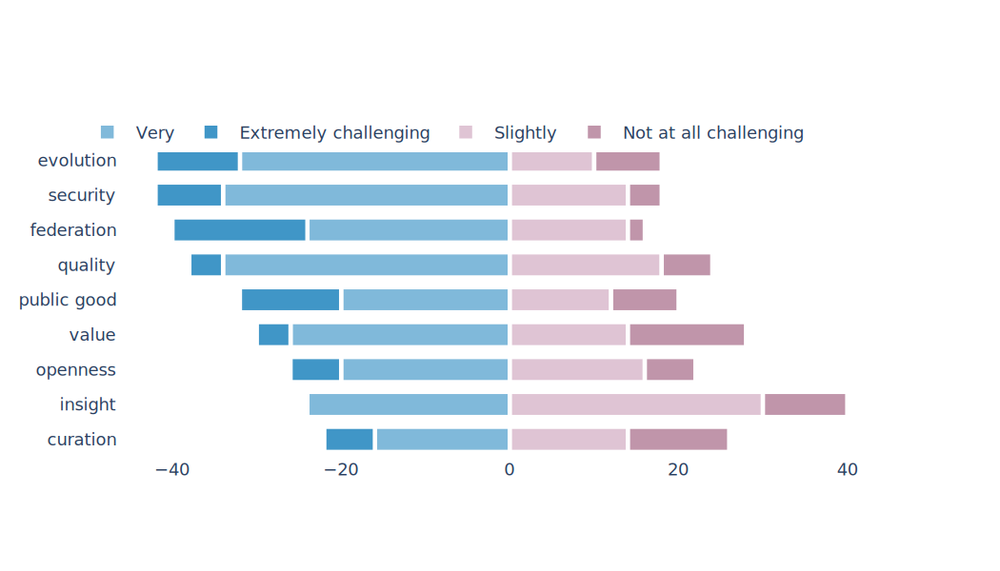

When comparing principles relative to each other, "Quality" and "Security" emerged in the upper right quadrant, indicating that, relatively speaking, they were the most challenging principles among those rated as most relevant. These two principles are good candidates to be worked out further, as most practitioners would benefit from more specific and illustrative best practices in those areas.

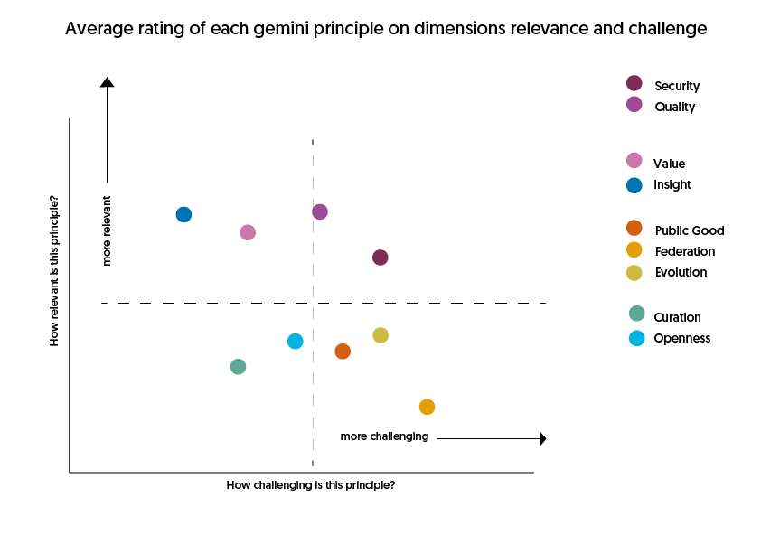

**9. Mixed Interest in Connected Digital Twins and Challenges in Establishing Trust**  
Only about half (55%) of respondents reported considering sharing data or models with other organizations to build connected digital twins, which may explain why the "Federation" principle received relatively low relevance ratings. This suggests that not all digital twin practitioners are focused on creating connected digital twins. Among those who did pursue connected twins, 67% found it difficult to establish trust in the resulting shared digital twin. The challenges reported included a broad range of issues, with the most common being intellectual property rights, data confidentiality, interoperability, and insufficient digital awareness. This indicates that for those who find "Federation" relevant, it is often perceived as highly challenging to implement.

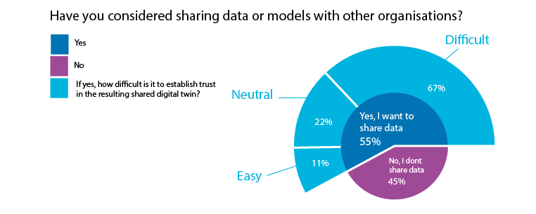

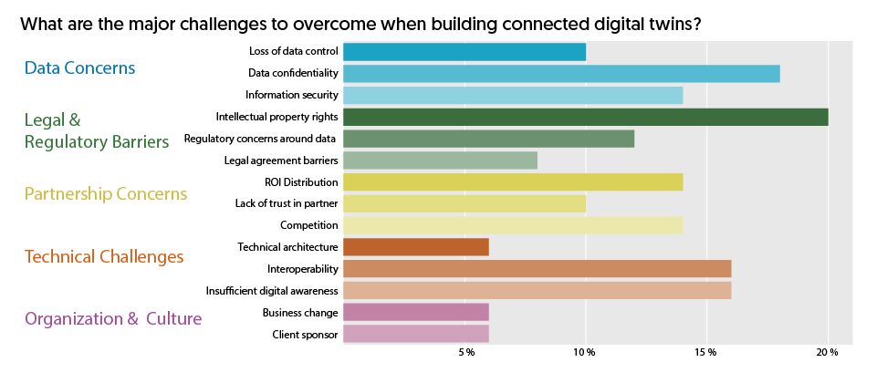

**10. Key Challenges in Implementing the Gemini Principles: Uncertainty, Lack of Standards, and Communication Barriers**  
The main challenges reported when putting the Gemini Principles into practice were categorized into four key themes: "Not knowing how," "Communicating value," "Data Concerns," and "Lack of consistency."

The theme "Not knowing how" best encapsulates a sense of uncertainty among respondents, often reflecting an inability to determine where to begin or a lack of the necessary knowledge, including the absence of appropriate metrics or KPIs. This theme was especially prominent for principles like "Public good," "Evolution," and "Value," highlighting that the digital twin space is still developing and that some sectors exhibit lower maturity when addressing these foundational concepts. For instance:
- “It is not clear what public good in perpetuity would look like.”
- “It is hard to objectively measure public good.”
- “Terms are not well enough defined in our context.”

"Data Concerns" and "Lack of consistency" often co-occurred, encompassing issues ranging from specific data quality problems to broader challenges like the absence of consistent standards across the community. Examples include:  
- “The acquisition of data on which digital twins are typically built is generally not standard in medical practice.”  
- “Lack of standards and frameworks for data exchange among physical digital twins.”

Finally, the challenge of "Communicating value" was often linked to principles such as "Value," "Openness," and "Federation." Respondents referred to the difficulty of establishing a shared understanding of a digital twin's value among multiple stakeholders. Examples include:  
- “Being able to communicate the value to their end user.”  
- “Interoperability is a challenge (…) including getting partners to understand the opportunity and benefit at a system of systems level.”

These challenges demonstrate that while the Gemini Principles are recognized as important, there are still significant barriers to their implementation, with many sectors struggling to apply these high-level concepts effectively.
## ABA Readiness

**11. Readiness for Argument-Based Assurance: Interest in Tools but Uncertainty Remains**  
When asked about their readiness for a tool to support argument-based assurance, 48% of respondents indicated that such a tool would enhance trust in their digital twins by helping structure and communicate how assurance measures align with ethical goals. Another 38% expressed interest but required more information to fully understand its utility, while only 14% did not see the value of such a tool. Among those interested, common benefits mentioned were the potential for a more **standardized approach**, **improved understanding** of both the system and assurance process, and the ability to **challenge or revisit** assurance arguments. In contrast, those who were not interested in the tool often cited that it was **not applicable** to their work or did **not align with existing communication practices** with their stakeholders.

**12. Lack of Established Frameworks for Trustworthy and Ethical Digital Twins**  
A significant gap was identified in the foundational understanding of digital twin ethics, with 72% of respondents indicating that their organizations lacked an established definition or framework for trustworthy and ethical digital twins. This highlights a lack of clarity in operationalizing ethical principles.

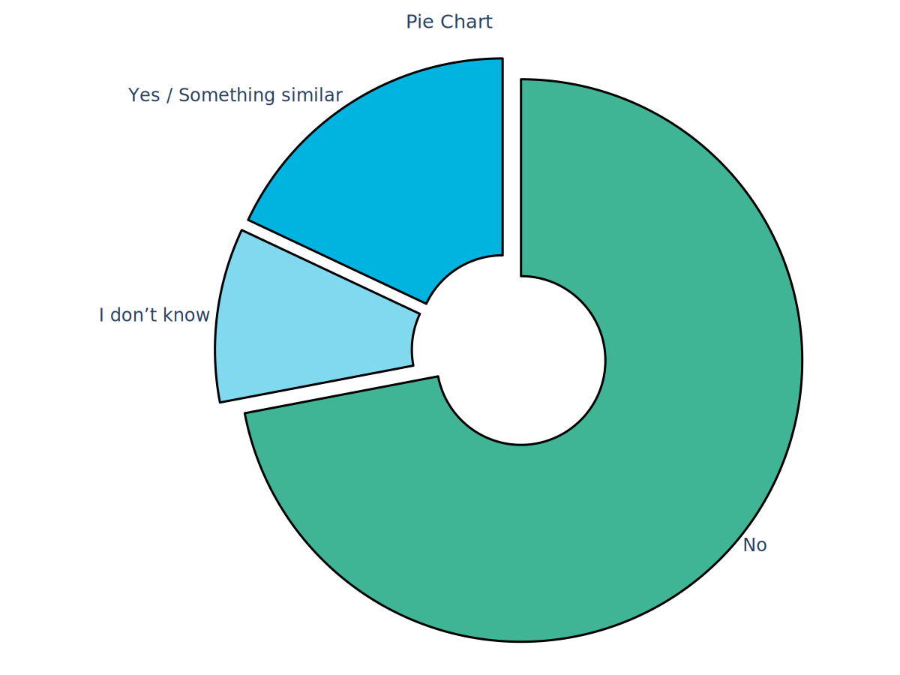

**13. Gap in Structuring and Communicating Assurance Cases**  
The majority of respondents (64%) communicate their assurance work verbally during meetings, with 42% not using any structured approach for this communication. Only 30% use visual aids in their reports, demonstrating a clear gap in effectively structuring and conveying assurance cases across the industry. Although some respondents do follow established standards or use visual aids, further exploration is needed to better understand current practices and identify how TEA could support and integrate with these existing approaches.

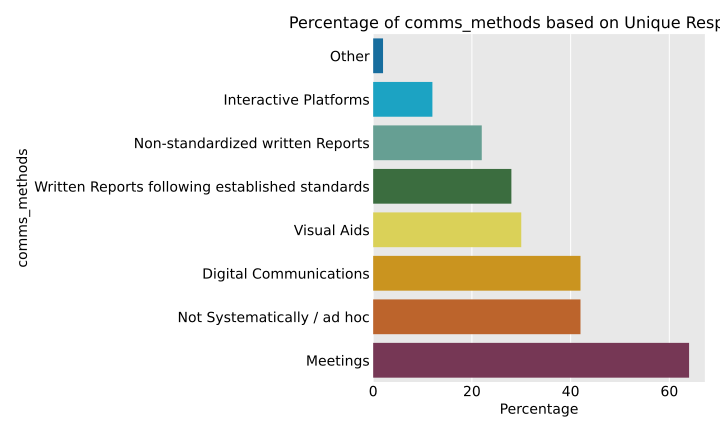

**14. Value Demonstration and Skills Training Identified as Key Needs for Tool Adoption**  
When asked about the support needed to adopt the TEA tool and create assurance cases around ethical principles, the majority of respondents indicated that they would require a **value demonstration** to justify building an assurance case, emphasizing the need for a clear business justification. Additionally, a significant number of respondents highlighted their lack of expertise in implementing assurance tools as a major challenge, making **skills training** the second most requested form of support. A substantial number of respondents selected costs and lack of time as potential challenges, although those were chosen less frequently. The least frequently selected challenges were around internal resistance and integration with governance process or tech stack. Interestingly, community forums were the least requested support option, chosen by only 24% of respondents, suggesting a preference for more direct or formal methods of learning and engagement.

# Appendix

TODO: add List of survey questions
